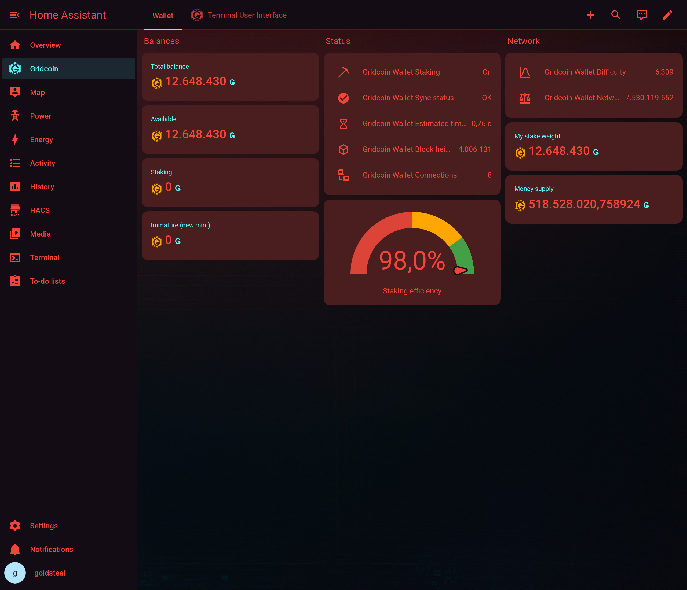
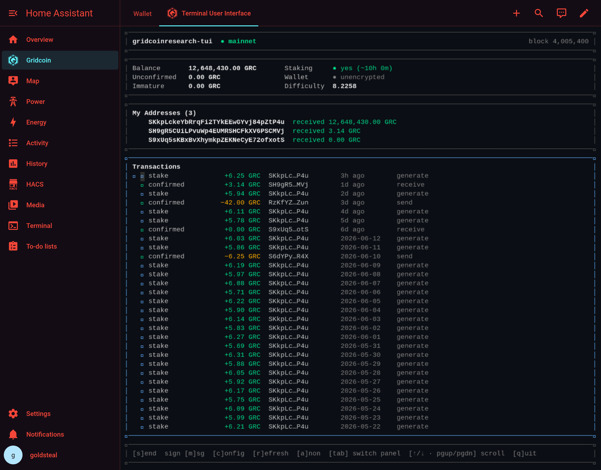
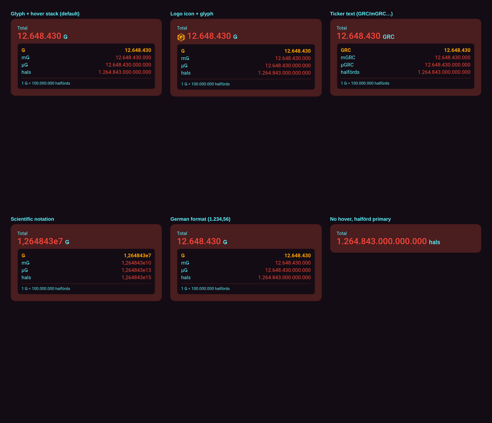

# Gridcoin for Home Assistant

Monitor a Gridcoin Research wallet in Home Assistant: balance/staking **sensors**
on your dashboard, plus the full **`gridcoin-tui`** wallet view embedded in the UI.

Everything talks to the wallet daemon over JSON-RPC (`gridcoinresearch.conf`).
This repo is verified against a daemon at `192.0.2.10:15715`.



> All amounts and addresses shown in the screenshots below are placeholder
> values, not real holdings.

## What's in the box

| Part | Folder | What it does |
| --- | --- | --- |
| **Integration** (HACS) | `custom_components/gridcoin/` | Sensors + binary sensors via RPC |
| **TUI add-on** (HAOS) | `gridcoin_tui/` | `gridcoin-tui` over ttyd + ingress |
| **Standalone container** | `docker/` | Same TUI for non-HAOS / external use |
| **Dashboard example** | `dashboards/gridcoin.yaml` | Cards wiring it together |

## 1. Sensors — the integration

Exposes: total balance, available balance, stake, immature (new mint), block
height, connections, difficulty, money supply, network & own stake weight,
estimated time to stake, staking efficiency, plus `staking` and `sync status`
binary sensors. (Magnitude is omitted — this wallet is a non-cruncher with no
beacon; it can be added later if a beacon is attached.)

**Install via HACS:** add this repo as a *custom repository* (type *Integration*),
install **Gridcoin Wallet**, restart HA, then **Settings → Devices & Services →
Add Integration → Gridcoin**. Enter host, port, RPC username and password.

**Manual:** copy `custom_components/gridcoin/` into your HA `config/custom_components/`
and restart.

> The daemon must permit RPC from Home Assistant — add HA's IP to `rpcallowip`
> in `gridcoinresearch.conf` and restart the daemon.

## 2. The wallet view — three ways to run the TUI

The `gridcoin-tui` terminal wallet — balances, your addresses, and recent
transactions — embedded in Home Assistant:



> The terminal wallet is **[gridcoinresearch-tui](https://github.com/gridcat/gridcoinresearch-tui)**
> by gridcat (MIT) — see [Credits](#credits).

There are three deployment shapes:

1. **HAOS add-on, internal mode** *(recommended for HAOS)* — the
   add-on runs the bundled TUI binary itself.
   Add this repo under **Settings → Add-ons → Add-on Store → ⋮ → Repositories**,
   install **Gridcoin TUI**, set `mode: internal` + RPC details, start it. Open
   from the sidebar.

2. **HAOS add-on, proxy mode** — point the add-on at an *already-running* ttyd
   (e.g. the `docker/` stack elsewhere). Set `mode: proxy` and `external_ttyd_url`.
   You keep HA authentication via ingress.

3. **Standalone container** — for HA Container/Core, or to host the terminal on
   any box. See `docker/`:
   ```bash
   cd docker && cp .env.example .env   # set GRC_RPC_PASSWORD
   docker compose up -d --build        # serves ttyd on :7681
   ```

The second "whole wallet" view, the
[Gridcoin Web Client](https://github.com/rsparlin/Gridcoin-Web-Client) GUI, is
wired as an optional (commented) service in `docker/compose.yaml`.

## 3. Dashboard

Import `dashboards/gridcoin.yaml`. To embed the **ingress** add-on as a card,
install [`ha-addon-iframe-card`](https://github.com/lovelylain/ha-addon-iframe-card)
via HACS; for the standalone container, the included plain `iframe` card pointing
at `http://<host>:7681` works as-is.

### Add Gridcoin to your Overview

The integration's entities belong to a **Gridcoin** device, so they appear
automatically on the auto-generated **Overview** dashboard (a device card) with
no configuration. To add a compact **summary row** to any dashboard — including
your main Overview — drop in a few **badges** (Settings → Dashboards → your
dashboard → ⋮ → *Edit in YAML*, or the visual *Add badge* button):

```yaml
badges:
  - type: entity
    entity: sensor.gridcoin_wallet_total_balance
    name: GRC Balance
  - type: entity
    entity: binary_sensor.gridcoin_wallet_staking
    name: Staking
  - type: entity
    entity: sensor.gridcoin_wallet_estimated_time_to_stake
    name: Next Stake
```

The same block is included at the top of `dashboards/gridcoin.yaml`. Any of the
`sensor.gridcoin_wallet_*` entities work as badges or in a `glance`/`gauge`/
`entities` card.

### The `grc-amount-card`

The integration also ships a custom Lovelace card, **`grc-amount-card`**, that
shows a GRC amount with an optional hover **conversion stack** across the
denomination ladder — GRC (`Ǥ`), mGRC, µGRC, and the halförd (`hal`, the `1e-8`
protocol floor). Add it from the card picker (*Gridcoin Amount*) or in YAML:

```yaml
type: custom:grc-amount-card
entity: sensor.gridcoin_wallet_total_balance
name: Total
```

The same amount, rendered with different options:



| Option | Default | What it does |
| --- | --- | --- |
| `entity` | — | **Required.** A GRC-valued sensor. |
| `name` | entity name | Card label. |
| `primary` | `GRC` | Unit of the big number: `GRC`, `mGRC`, `µGRC`, or `halförd`. |
| `hover` | `true` | Show the hover conversion stack. |
| `denoms` | all four | Which denominations appear in the stack. |
| `base_units` / `hover_units` | `[glyph]` | How the unit is shown — any mix of `glyph` (Ǥ), `ticker` (GRC), `icon` (logo). |
| `icon` | `grc:gridcoin` | Logo used by the `icon` unit form. |
| `active` | = `primary` | Denomination highlighted in the stack. |
| `decimals` | `8` | Max decimals before rounding. |
| `scientific` | `false` | Scientific notation (e.g. `1.264843e7`). |
| `plural` | `auto` | Halförd plural: `auto` / `singular` / `plural`. |
| `number_format` | `language` | Separators: follow HA (`language`), `comma_decimal`, `decimal_comma`, `space_comma`, `none`. |

Amounts are computed in exact integer halförds (BigInt), so conversions never
drift, and a GUI editor is included for every option.

## Notes & caveats

- The `gridcoinresearch-tui` terminal is **compiled from source** (gridcat,
  `v1.3.0`, MIT) for each supported architecture during the image build — no
  binary is vendored in this repo. Pin a different upstream tag with the
  `TUI_VERSION` build arg.
- RPC credentials live in HA config / add-on options — keep your HA instance
  trusted; prefer a dedicated read-mostly RPC user.

## Credits

The embedded terminal wallet is **[gridcoinresearch-tui](https://github.com/gridcat/gridcoinresearch-tui)**
by **gridcat**, MIT-licensed (bundled v1.3.0). This project wraps it for Home
Assistant; full license text is in
[`THIRD_PARTY_NOTICES.md`](THIRD_PARTY_NOTICES.md).

## Tip jar

If this project saved you some setup time, Gridcoin tips are appreciated:

```
S8eTy1hwNjDBNsJad6d9YpdgjvNBsme2my
```
